# C4 — Nível 3: Componentes da Aplicação de Saúde

O diagrama de componentes detalha internamente o contêiner **Aplicação de Saúde**, principal unidade de implantação do sistema. Os componentes são organizados por capacidade de negócio, seguindo a decisão de monolito modular, enquanto dependências externas relevantes são isoladas por adaptadores.

```mermaid
flowchart TB

    subgraph aplicacao["Aplicação de Saúde — unidade de implantação"]
        direction TB

        entrada["<b>API de Entrada</b><br/><small>Recebe requisições do Portal Web e da Aplicação da Unidade</small>"]

        subgraph modulos[" "]
            direction LR

            atendimento["<b>Triagem e Atendimento</b><br/><small>Registra triagens e atendimentos</small>"]

            prontuario["<b>Prontuário Eletrônico</b><br/><small>Mantém histórico clínico, receitas e auditoria</small>"]

            regulacao["<b>Regulação</b><br/><small>Coordena solicitações de leitos e transporte</small>"]
        end

        subgraph modulos2[" "]
            direction LR

            farmacia["<b>Farmácia e Estoque</b><br/><small>Controla dispensação, lotes e validade</small>"]

            agendamento["<b>Agendamento</b><br/><small>Gerencia consultas, exames e vacinação</small>"]

            vigilancia["<b>Vigilância Epidemiológica</b><br/><small>Registra notificações e informações epidemiológicas</small>"]
        end

        subgraph bordas[" "]
            direction LR

            legadoAdapter["<b>Adaptador de Regulação Legada</b><br/><small>Traduz o modelo novo para o contrato legado</small>"]

            mensageria["<b>Adaptador de Mensageria</b><br/><small>Registra tarefas de integração assíncrona</small>"]
        end
    end

    banco[("<b>Banco de Dados Central</b><br/><small>Dados pertencentes aos módulos</small>")]

    legado["<b>Sistema legado de regulação</b><br/><small>Autoridade das capacidades ainda não migradas</small>"]

    fila["<b>Fila Persistente</b><br/><small>Tarefas pendentes de integração</small>"]

    entrada -->|"chamada de procedimento"| atendimento
    entrada -->|"chamada de procedimento"| prontuario
    entrada -->|"chamada de procedimento"| regulacao
    entrada -->|"chamada de procedimento"| farmacia
    entrada -->|"chamada de procedimento"| agendamento
    entrada -->|"chamada de procedimento"| vigilancia

    atendimento -->|"chamada de procedimento"| prontuario
    farmacia -->|"chamada de procedimento<br/>valida receita"| prontuario

    regulacao -->|"chamada por porta secundária"| legadoAdapter
    legadoAdapter -->|"chamada de procedimento remota"| legado

    vigilancia -->|"chamada por porta secundária"| mensageria
    mensageria -->|"fila"| fila

    atendimento -->|"acesso a dados"| banco
    prontuario -->|"acesso a dados"| banco
    regulacao -->|"acesso a dados"| banco
    farmacia -->|"acesso a dados"| banco
    agendamento -->|"acesso a dados"| banco
    vigilancia -->|"acesso a dados"| banco

    style modulos fill:none,stroke:none
    style modulos2 fill:none,stroke:none
    style bordas fill:none,stroke:none

    style aplicacao fill:#ffffff,stroke:#444444,stroke-width:2px,stroke-dasharray:6 4

    style entrada fill:#1168bd,color:#fff,stroke:#0b4884

    style atendimento fill:#438dd5,color:#fff,stroke:#0b4884
    style prontuario fill:#438dd5,color:#fff,stroke:#0b4884
    style regulacao fill:#438dd5,color:#fff,stroke:#0b4884
    style farmacia fill:#438dd5,color:#fff,stroke:#0b4884
    style agendamento fill:#438dd5,color:#fff,stroke:#0b4884
    style vigilancia fill:#438dd5,color:#fff,stroke:#0b4884

    style legadoAdapter fill:#85bbf0,color:#000,stroke:#0b4884
    style mensageria fill:#85bbf0,color:#000,stroke:#0b4884

    style banco fill:#438dd5,color:#fff,stroke:#0b4884

    style legado fill:#999,color:#fff,stroke:#777
    style fila fill:#999,color:#fff,stroke:#777
```



## Responsabilidades e fronteiras

**API de Entrada:** recebe as chamadas originadas pelo Portal Web e pela Aplicação da Unidade e encaminha a operação para a interface pública do módulo correspondente. Não concentra regras de negócio.

**Triagem e Atendimento:** controla os registros produzidos durante triagem e atendimento. As operações provenientes da sincronização offline chegam a este módulo pela mesma interface pública das operações realizadas online.

**Prontuário Eletrônico:** é responsável pelo histórico clínico, receitas e informações de auditoria associadas ao prontuário.

**Regulação:** coordena solicitações de leitos e transporte. A forma de confirmar uma reserva depende de qual sistema possui a autoridade daquela capacidade durante a migração.

**Farmácia e Estoque:** mantém estoque, lotes, validade e dispensações. Quando necessita validar uma receita, utiliza a interface pública do módulo de Prontuário em vez de acessar suas tabelas diretamente.

**Agendamento:** mantém consultas, exames, vacinação e demais agendamentos.

**Vigilância Epidemiológica:** registra as notificações compulsórias no sistema municipal e solicita posteriormente a criação das tarefas de integração externa.

**Adaptador de Regulação Legada:** implementa a porta utilizada pelo módulo de Regulação para conversar com o sistema legado e funciona como camada anticorrupção entre os dois modelos.

**Adaptador de Mensageria:** esconde do módulo de Vigilância os detalhes da infraestrutura de mensageria e encaminha tarefas assíncronas para a Fila Persistente.

## Regra de autoridade da regulação

Enquanto uma capacidade de regulação **ainda não foi migrada**, o módulo de Regulação não confirma a mesma reserva de forma independente no banco novo.

O fluxo é:

```text
Regulação
   ↓
Adaptador de Regulação Legada
   ↓
Sistema legado
   ↓
confirmação ou recusa
```

Nesse estágio, o **sistema legado é a única autoridade de escrita** para aquela capacidade.

Depois que a capacidade for migrada, a responsabilidade passa ao módulo de Regulação:

```text
Regulação
   ↓
Banco de Dados Central
```

A partir desse momento, o legado deixa de confirmar novas operações dessa capacidade.

Assim, não existe um período em que os dois sistemas sejam autoridades simultâneas sobre a mesma reserva.

## Regras de fronteira entre módulos

1. Cada módulo publica uma interface pública restrita.
2. Um módulo não acessa diretamente a implementação interna de outro.
3. Cada módulo é proprietário de seus dados e não realiza consultas diretas às tabelas de outro módulo.
4. Quando uma resposta imediata é necessária, a comunicação entre módulos ocorre por chamada em processo à interface pública.
5. Dependências externas relevantes são acessadas por portas e adaptadores.
6. Ciclos de dependência entre módulos não são permitidos.
7. O banco é fisicamente compartilhado, mas a propriedade de dados permanece lógica e exclusiva por módulo.

As setas dos módulos para o Banco de Dados Central representam seus respectivos mecanismos de persistência. Adaptadores de persistência individuais foram omitidos do desenho para manter o nível de detalhe e a legibilidade do C4.

## Relação com os ADRs

- **ADR 0001:** define o monolito modular e as fronteiras hexagonais.
- **ADR 0002:** define propriedade e consistência dos dados.
- **ADR 0003:** define a integração e substituição gradual do legado.
- **ADR 0005:** define a sincronização idempotente das operações offline.
- **ADR 0006:** define o uso localizado de mensageria para integrações assíncronas.
