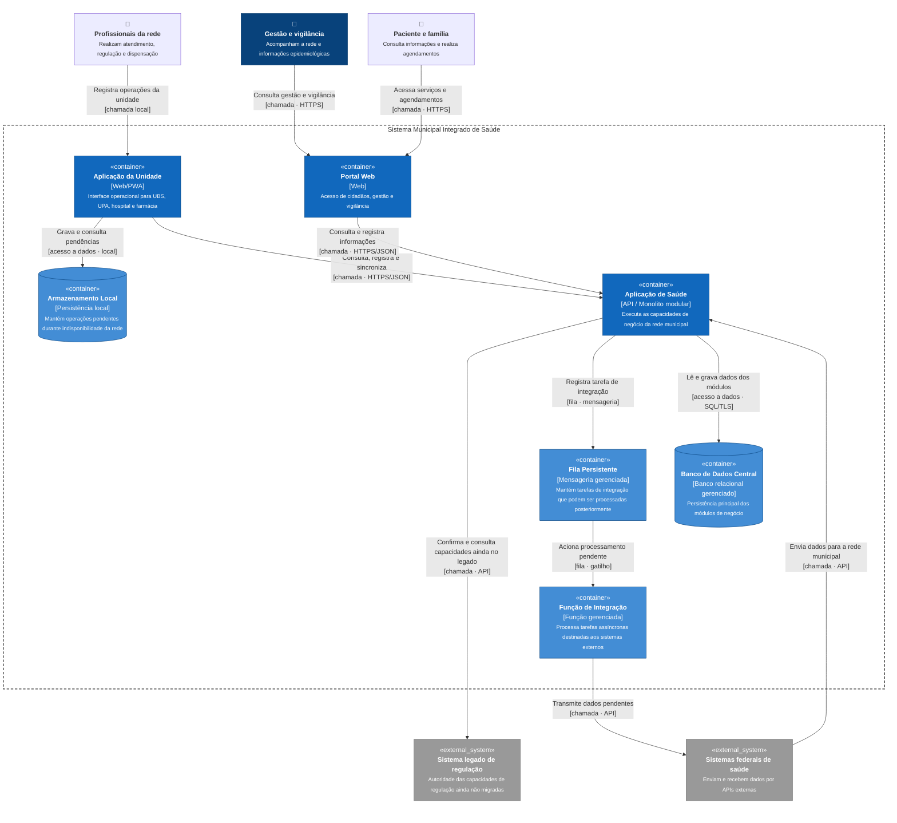

# C4 — Nível 2: Contêineres

O diagrama de contêineres apresenta as principais unidades executáveis e de armazenamento do Sistema Municipal Integrado de Saúde. A arquitetura mantém uma aplicação principal em monolito modular e utiliza serviços gerenciados apenas nas fronteiras em que há necessidade específica de persistência, mensageria ou processamento assíncrono.

## Responsabilidades dos contêineres

**Portal Web:** oferece as funcionalidades destinadas aos cidadãos e às áreas de gestão e vigilância. Não depende do mecanismo de armazenamento offline utilizado nas unidades de atendimento.

**Aplicação da Unidade:** é utilizada pelos profissionais das UBS, UPAs, hospital e farmácia. Permite acesso às capacidades da Aplicação de Saúde e controla as operações locais que precisam sobreviver às interrupções de conectividade.

**Armazenamento Local:** mantém temporariamente operações ainda não confirmadas pelo sistema central. Não representa uma segunda fonte de verdade da rede e é utilizado somente para as capacidades autorizadas a funcionar offline.

**Aplicação de Saúde:** contém os módulos de negócio do sistema e constitui a principal unidade de implantação. Internamente segue a estrutura de monolito modular definida no ADR 0001.

**Banco de Dados Central:** mantém a persistência principal do sistema. Embora fisicamente compartilhado, os dados são logicamente separados e possuem proprietário definido por módulo, conforme o ADR 0002.

**Fila Persistente:** armazena tarefas de integração que não precisam de resposta imediata. Seu uso é localizado e não transforma toda a aplicação em uma arquitetura orientada a eventos.

**Função de Integração:** é acionada pela fila para executar trabalhos assíncronos curtos, como transmitir notificações e outros dados aos sistemas federais. A indisponibilidade do destino não mantém uma requisição da unidade de saúde bloqueada.

## Decisões evidenciadas pelo diagrama

O suporte offline existe somente entre a **Aplicação da Unidade**, o **Armazenamento Local** e a **Aplicação de Saúde**. Quando a conexão retorna, as operações pendentes são sincronizadas de forma idempotente conforme o ADR 0005.

A comunicação com o **Sistema Legado de Regulação** permanece síncrona nas capacidades que ainda dependem dele. Enquanto uma capacidade não tiver sido migrada, o legado permanece como sua única autoridade de escrita, conforme os ADRs 0002 e 0003.

As integrações externas que não exigem resposta imediata passam pela **Fila Persistente** e pela **Função de Integração**. Já dados recebidos dos sistemas federais entram pela API da Aplicação de Saúde e são tratados pelos adaptadores correspondentes.

O diagrama contém **12 elementos**, respeitando o limite de legibilidade adotado no capítulo 3 do livro.
