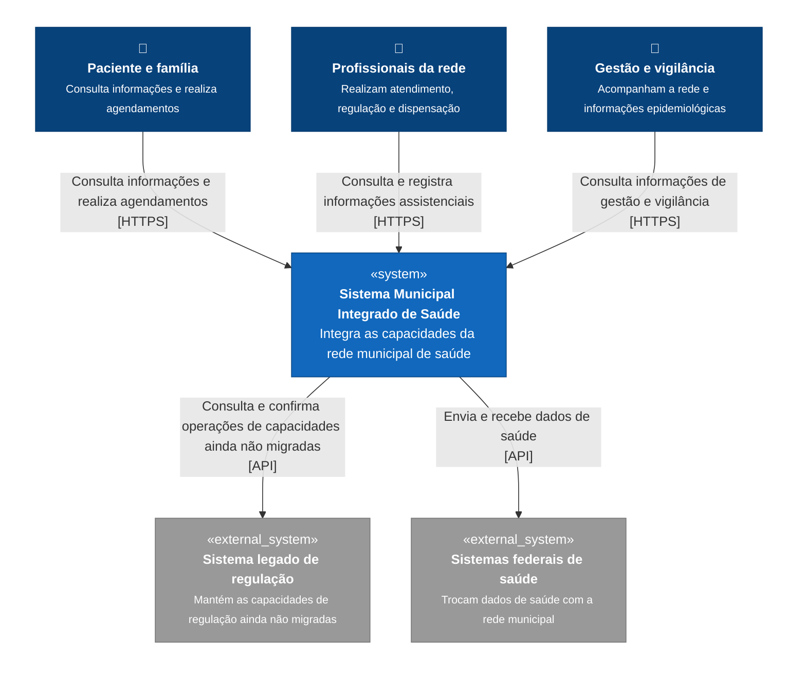

# C4 — Nível 1: Contexto

O diagrama de contexto apresenta o **Sistema Municipal Integrado de Saúde** como uma única caixa e mostra os principais grupos de usuários e sistemas externos com os quais ele se comunica.

## Relações principais

**Paciente e família:** utilizam o sistema para consultar informações disponíveis ao cidadão e realizar agendamentos.

**Profissionais da rede:** utilizam o sistema durante atendimento, registro clínico, regulação de leitos, dispensação de medicamentos e demais atividades assistenciais.

**Gestão e vigilância:** utilizam as informações consolidadas da rede para acompanhamento da operação e das atividades de vigilância epidemiológica.

**Sistema legado de regulação:** permanece externo ao novo sistema durante o processo de migração. Enquanto uma capacidade ainda não tiver sido migrada, as operações correspondentes continuam dependendo do legado como autoridade.

**Sistemas federais de saúde:** recebem e fornecem dados por integrações externas. Sua eventual indisponibilidade não deve impedir a continuidade das operações locais que não dependem de resposta imediata desses sistemas.

## Escopo representado

Neste nível, detalhes internos como Portal Web, Aplicação da Unidade, banco de dados, fila e módulos de negócio não aparecem. Esses elementos pertencem aos níveis de contêineres e componentes.

O objetivo deste diagrama é mostrar apenas:

- quem utiliza o Sistema Municipal Integrado de Saúde;
- quais sistemas externos participam de seus fluxos;
- quais informações ou operações atravessam essas fronteiras.
